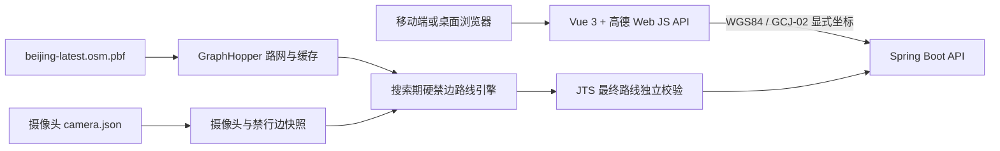

# 摄像头安全路线规划

一个面向北京区域的移动端优先 Web 路线规划 MVP。用户输入起点和终点后，后端基于本地 OSM 路网规划驾车路线，并在搜索过程中硬避开摄像头点位对应的道路；网页负责高德地图展示、当前位置显示和手动从当前位置重新规划。

> 当前项目属于技术验证版本。摄像头来源、坐标精度和 OSM 道路属性仍需持续核验，路线结果不能替代交通法规、道路标志或正式导航产品。

## 当前状态

- 前端 Vue 页面、地图展示、浏览器定位、摄像头图层和手动重新规划已实现。
- 后端 Spring Boot API、GraphHopper 搜索期硬禁边、JTS 独立安全校验和快照持久化已实现。
- 默认安全半径为 30 米；任何成功路线都必须满足 `cameraConflictCount = 0`，不存在违规降级路线。
- 当前摄像头源为 6,803 条；生产加载器只排除 `IsSixRingOut` 语义为 `1` 的记录，缺失或非法值保留并计数。
- 当前保留 5,707 个点，其中 30 米匹配 5,688 个、未匹配 19 个。
- 摄像头远程更新已支持后端内部定时执行和本机手动触发；默认关闭，确认数据源使用许可后通过环境变量开启。
- 当前仅承诺北京区域、驾车、手动重新规划，不包含自动偏航重算和逐向导航。

详细进度和未完成项见 [开发计划与当前进度](docs/开发计划与当前进度.md)。

## 核心设计



安全约束分成两层：GraphHopper 在 A*/Dijkstra 搜索期间把禁行边权重设为无穷，JTS 在返回前再次检查路线几何。仅在两层均通过时返回路线。

## 技术栈

| 模块 | 技术 |
|---|---|
| 前端 | Vue 3、TypeScript、Vite、Pinia、高德地图 Web JS API 2.0 |
| 前端测试 | Vitest、Vue Test Utils、Playwright |
| 后端 | Java 21、Spring Boot 3.5、Maven 3.8+ |
| 路由与空间 | GraphHopper 11、JTS 1.20、OSM PBF |
| 数据存储 | 外部文件目录、GraphHopper 图缓存、版本化 JSON 快照 |

选择单体 Java 后端是为了直接嵌入 GraphHopper，降低首期部署和跨服务调用复杂度。前端只消费与客户端无关的 HTTP API，后续 App 可以复用同一后端。

## 仓库结构

```text
code/
├─ README.md                 项目入口
├─ .gitignore               统一忽略规则
├─ docs/                    当前规范、计划、契约和验证报告
├─ scripts/                 跨模块开发辅助脚本
├─ server/                  Java 后端
└─ web/                     Vue 前端
```

PBF、摄像头 JSON、图缓存、运行快照、证书和真实密钥不属于 Git 仓库。

后端包职责、前端目录、启动/路线/更新调用链以及常见改动位置见 [代码结构与核心流程](docs/代码结构与核心流程.md)。

## 外部数据目录

Windows 默认使用后端启动所在盘根目录的 `camera-safe-routing-data`。例如从 `F:` 盘的 IDEA 工程启动，默认目录为：

```text
F:\camera-safe-routing-data\
├─ osm\beijing-latest.osm.pbf
├─ cameras\camera.json
├─ graph-cache\beijing\
├─ snapshots\
├─ downloads\
├─ work\
└─ backups\
```

在 `code` 目录执行以下脚本可创建结构：

```powershell
.\scripts\init-data-directory.ps1
```

如果希望使用其他位置，只设置一个系统或 IDEA 环境变量即可：

```text
ROUTING_DATA_ROOT=D:\camera-safe-routing-data
```

单项路径仍可覆盖，但普通开发不需要。完整规则见 [运行配置与数据目录](docs/运行配置与数据目录.md)。

## 数据来源

| 数据 | 当前用途 | 来源 |
|---|---|---|
| 北京 OSM PBF | 当前北京路网 | [beijing-latest.osm.pbf](http://download.openstreetmap.fr/extracts/asia/china/beijing-latest.osm.pbf) |
| 中国 OSM PBF | 后续自动切分京津冀 | [china-latest.osm.pbf](http://download.openstreetmap.fr/extracts/asia/china-latest.osm.pbf) |
| 摄像头点位 | 禁行点快照 | `POST https://www.jjz365.cn/CameraData/GetAllRing`，正式文件名为 `camera.json` |

OSM 数据遵循 Open Database License，地图或衍生数据发布时必须保留 OpenStreetMap 署名。摄像头接口的可用性、使用许可、频率限制和字段稳定性需要在自动同步上线前确认。

## 环境要求

- JDK 21
- Maven 3.8 或更高版本
- Node.js 24.16.x
- npm 11 或与 Node 24 配套版本
- IntelliJ IDEA、WebStorm 可选
- 高德 Web JS Key 和安全密钥，仅保存在 `web/.env.local`

## 后端启动

1. 将北京 PBF 放到数据根目录的 `osm/beijing-latest.osm.pbf`。
2. 将摄像头 JSON 放到 `cameras/camera.json`。
3. IDEA 打开 `server/pom.xml`，Project SDK、Maven Runner JRE 均选择 JDK 21。
4. 启动类为 `cn.camera.safe.CameraSafeRoutingApplication`，建议 VM options 使用 `-Xms1g -Xmx2g`。

也可以从 PowerShell 启动：

```powershell
Set-Location .\server
mvn test
mvn spring-boot:run
```

首次启动会解析 PBF 并生成图缓存；后续启动直接加载缓存。PBF 内容变化时不得继续复用旧缓存，服务会通过 SHA-256 元数据拒绝不一致组合。

就绪检查：

```powershell
Invoke-RestMethod http://localhost:8080/api/v1/health
curl.exe -i http://localhost:8080/api/v1/readiness
```

## 前端启动

在 `web/.env.local` 填写本机配置：

```dotenv
VITE_AMAP_KEY=你的高德WebJSKey
VITE_AMAP_SECURITY_CODE=你的高德安全密钥
VITE_API_BASE_URL=
VITE_USE_MOCK_API=false
```

本地开发推荐让 `VITE_API_BASE_URL` 保持为空，Vite 会把同源 `/api` 代理到 `http://127.0.0.1:8080`。

```powershell
Set-Location .\web
npm ci
npm run dev
```

桌面浏览器通常可通过 `http://localhost:5173` 访问。

### 手机 HTTPS 开发

手机通过局域网访问时，浏览器 Geolocation 通常要求可信 HTTPS。`npm run dev:https` 固定读取：

```text
web/certs/dev-cert.pem
web/certs/dev-key.pem
```

这两个文件不会提交到 Git，每台开发电脑都需要单独生成。Windows 推荐通过 winget 安装：

```powershell
winget install FiloSottile.mkcert
```

winget 不可用时，可从 [mkcert 官方发行版](https://github.com/FiloSottile/mkcert/releases) 安装。安装后重新打开 PowerShell，并确认可以执行 `mkcert`。

先通过 `ipconfig` 找到电脑当前局域网 IPv4，例如 `192.168.1.20`，然后在 `web` 目录执行：

```powershell
Set-Location .\web
New-Item -ItemType Directory -Path .\certs -Force | Out-Null
mkcert -install
mkcert `
  -cert-file .\certs\dev-cert.pem `
  -key-file .\certs\dev-key.pem `
  localhost 127.0.0.1 ::1 192.168.1.20
npm run dev:https
```

把示例 IP 替换为本机实际局域网 IP。证书必须包含手机访问时使用的 IP；电脑 IP 变化后需要重新生成证书。

电脑执行 `mkcert -install` 后会信任本地开发 CA。手机还需要信任同一个开发 CA：

```powershell
mkcert -CAROOT
```

该命令会显示 CA 目录。只把其中的 `rootCA.pem` 安装到自己的测试手机，绝不能复制或分享 `rootCA-key.pem`。

- Android：在系统安全设置中选择“安装 CA 证书”，菜单名称因系统版本而异。
- iOS：安装 `rootCA.pem` 描述文件后，还要在“设置 -> 通用 -> 关于本机 -> 证书信任设置”中启用完全信任。

随后在手机访问：

```text
https://192.168.1.20:5173
```

手机与电脑必须处于同一局域网，Windows 防火墙需要允许 Node/Vite，且高德控制台应允许当前开发来源。地址栏仍有证书警告时，定位权限通常不会正常工作；证书可信后还要在浏览器站点设置中允许位置访问。

完整真机检查项见 [验证与测试指南](docs/验证与测试指南.md)。

## 常用验证

后端：

```powershell
Set-Location .\server
mvn test
mvn package
```

前端：

```powershell
Set-Location .\web
npm run typecheck
npm run lint
npm run test
npm run build
```

真实 PBF、摄像头匹配报告、零冲突路线、API 冒烟和手机验证的完整命令见 [验证与测试指南](docs/验证与测试指南.md)。

## API

唯一机器可读契约为 [api-contract.yaml](docs/api-contract.yaml)。当前接口：

| 方法 | 路径 | 说明 |
|---|---|---|
| `POST` | `/api/v1/routes` | 规划零摄像头冲突路线 |
| `GET` | `/api/v1/cameras` | 按地图范围查询点位 |
| `GET` | `/api/v1/camera-snapshots/current` | 查询当前快照状态 |
| `POST` | `/api/v1/admin/camera-snapshots/refresh` | 本机触发摄像头快照刷新 |
| `POST` | `/api/v1/admin/camera-data/update` | 本机立即下载、校验并发布摄像头数据 |
| `GET` | `/api/v1/health` | 进程存活状态 |
| `GET` | `/api/v1/readiness` | 路网、摄像头和禁行边就绪状态 |

坐标系和错误码约定见 [坐标系与接口约定](docs/坐标系与接口约定.md)。

## 文档入口

- [文档索引](docs/README.md)
- [产品需求与技术方案](docs/产品需求与技术方案.md)
- [代码结构与核心流程](docs/代码结构与核心流程.md)
- [运行配置与数据目录](docs/运行配置与数据目录.md)
- [开发计划与当前进度](docs/开发计划与当前进度.md)
- [自动化数据更新方案](docs/自动化数据更新方案.md)
- [Agent 开发规范](docs/Agent开发规范.md)
- [验证与测试指南](docs/验证与测试指南.md)
- [新路网摄像头匹配验证报告](docs/新路网摄像头匹配验证报告.md)

## GitHub 建仓注意事项

`server` 和 `web` 当前各自包含一份历史 `.git` 元数据。直接在 `code` 下执行 `git init` 会形成嵌套仓库，父仓库可能只记录 gitlink 而不记录真实源码。建立统一仓库前，应先把两份 `.git` 完整移动到 `code` 目录之外备份，确认 `git add server web` 能看到普通源码文件后再提交。

不要删除或覆盖这两份历史元数据，除非已经确认不需要各自的提交历史。新的根级 `.gitignore` 已排除构建产物、密钥、证书和运行数据。
