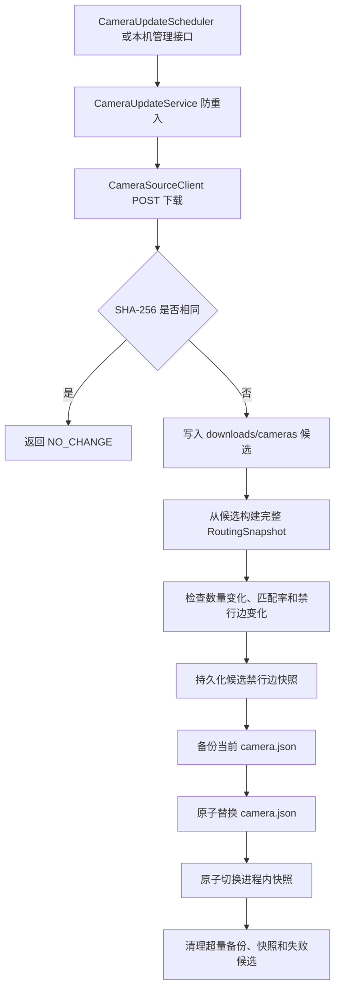

# 代码结构与核心流程

本文说明当前仓库的代码组织、模块职责和主要调用链。产品边界看 [产品需求与技术方案](产品需求与技术方案.md)，运行路径看 [运行配置与数据目录](运行配置与数据目录.md)，HTTP 字段以 [api-contract.yaml](api-contract.yaml) 为准。

## 1. 仓库边界

```text
camera-safe-router/
├─ README.md                 项目入口、启动方式和当前状态
├─ docs/                     当前设计、契约、计划和验证报告
├─ scripts/                  数据目录初始化和性能验证脚本
├─ server/                   Spring Boot + GraphHopper 后端
└─ web/                      Vue 3 + 高德地图前端
```

PBF、`camera.json`、GraphHopper 缓存、禁行边快照和备份都在仓库外的数据根目录中。代码不能依赖 IDE 工作目录中的真实数据文件。

## 2. 后端结构

后端源码根目录为 `server/src/main/java/cn/camera/safe`：

```text
cn.camera.safe/
├─ CameraSafeRoutingApplication.java  启动类、配置绑定和定时调度开关
├─ api/                               HTTP 控制器、错误处理和请求 ID
│  └─ model/                         API 请求与响应模型
├─ application/                       用例编排和服务生命周期
├─ camera/                            摄像头加载、过滤、快照和空间索引
│  └─ update/                        远程下载、定时更新、备份和原子发布
├─ config/                            配置属性和线程池
├─ coordinate/                        WGS84/GCJ-02 类型、转换和校验
├─ routing/                           GraphHopper、道路索引、禁行边和路由快照
└─ validation/                        返回路线的独立空间安全校验
```

### 2.1 包职责

| 包 | 职责 | 代表类 |
|---|---|---|
| `api` | 接收和校验 HTTP 请求，调用应用服务，统一输出错误 | `RouteController`、`CameraController`、`OperationsController`、`GlobalExceptionHandler` |
| `api.model` | 与 OpenAPI 对应的输入输出数据，不放业务算法 | `RouteRequest`、`RouteResponse`、`BoundaryCrossing`、`RouteSegment` |
| `application` | 组织一次完整用例，不实现底层空间算法 | `RoutePlanningService`、`CameraQueryService`、`BackendInitializer` |
| `camera` | 解析摄像头源、执行 `IsSixRingOut != 1` 过滤、建立不可变快照和查询索引 | `CameraJsonLoader`、`CameraSnapshot`、`CameraSpatialIndex` |
| `camera.update` | 从远程接口获取候选数据，校验、备份、发布和清理历史文件 | `CameraUpdateScheduler`、`CameraUpdateService`、`CameraSourceClient`、`CameraUpdateFileStore` |
| `coordinate` | 用类型区分坐标系并集中转换，防止 WGS84 和 GCJ-02 混用 | `CoordinateConverter`、`Wgs84Coordinate`、`Gcj02Coordinate` |
| `routing` | 管理路网、道路空间索引、搜索期硬禁边、六环通行口拓扑、多目标规划和版本化路由快照 | `GraphHopperManager`、`SixthRingRoutePlanner`、`EdgeKeyMultiTargetDijkstra`、`SixthRingPortalTopologyBuilder`、`RoutingSnapshotManager` |
| `validation` | 在 GraphHopper 返回路线后用独立几何检查确认零摄像头冲突 | `RouteSafetyValidator` |
| `config` | 绑定 `application.yml` 并创建有界执行器 | `AppProperties`、`ExecutorConfiguration` |

依赖方向通常是 `api -> application -> camera/routing/validation`。底层路由和摄像头代码不依赖 Controller；`OperationsController` 只为 health、readiness 和本机管理操作直接读取运行状态。

### 2.2 关键运行对象

| 对象 | 生命周期和作用 |
|---|---|
| `GraphHopperManager` | 进程内单例；按 profile 选择隔离缓存，校验 PBF/配置指纹，加载或构图并持有道路索引 |
| `RoutingGraphConfiguration` | 定义默认合规距离 profile、turn costs、road_access 规则和缓存兼容指纹 |
| `SixthRingBoundary` | 保存经过版本标识的内外六环 Polygon，并校验闭合几何的有效性和包含关系 |
| `SixthRingPortal` | 表示一个可搜索的有向边界通行状态，保留 edge key、方向、边上比例、边界节点和候选类型 |
| `SixthRingPortalTopologyBuilder` | 从当前 GraphHopper 图生成边内部、边端和边界重叠链通行口，并在节点转换时检查单向访问和 turn costs |
| `SixthRingPortalTopology` | 分别保存出环和入环候选及相交边、重叠边、边界节点和歧义边统计 |
| `SixthRingRoutingManager` | 在 GraphHopper 就绪后加载版本化边界、校验 PBF 哈希并构建当前有向通行口拓扑 |
| `SixthRingRoutePlanner` | 自动判定四种规划模式；跨界时运行正向/反向多目标搜索，再用完整参考路线决胜 |
| `EdgeKeyMultiTargetDijkstra` | 使用到达 edge key 作为状态，支持 turn costs、禁行边、反向搜索、QueryGraph 虚拟边和资源上限 |
| `RoutingSnapshot` | 不可变；把摄像头快照、摄像头空间索引和当前禁行边绑定为同一版本 |
| `RoutingSnapshotManager` | 用原子引用发布当前快照，用互斥锁防止刷新和远程更新并发切换 |
| `RoutingSnapshotStore` | 把禁行 edge ID 和版本信息写入外部 `snapshots` 目录，按内容去重并限量保留 |
| `CameraUpdateService` | 同步执行一次完整远程更新；定时任务和手动接口复用它 |

## 3. 后端核心流程

### 3.1 服务启动


启动流程不访问远程摄像头接口。远程接口失败不会阻止服务根据现有 `camera.json` 恢复路线能力。历史 `routing-snapshot-*.json` 用于审计，不会直接反序列化为进程内快照，因为 edge ID 必须与当前图缓存重新确认。

### 3.2 路线规划

```text
POST /api/v1/routes
  -> RouteController
  -> RoutePlanningService
  -> 输入坐标统一转换为 WGS84
  -> 检查路网范围和起终点限制
  -> SixthRingRoutePlanner 自动判定四种模式
  -> 环内路线：GraphHopperRoutingEngine 使用当前禁行边搜索
  -> 跨界路线：QueryGraph + EdgeKeyMultiTargetDijkstra 搜索 Dmin + 1000 米通行口
  -> 对候选通行口生成完整参考路线并按距离、时长、portal ID 决胜
  -> RouteSafetyValidator 独立检查 safeSegment
  -> 输出转换为 GCJ-02
  -> RouteResponse(通行口 + 分段路线 + 完整 geometry，cameraConflictCount = 0)
```

`BlockedEdgeWeighting` 在搜索阶段拒绝禁行基础边及其 QueryGraph 虚拟边。最终 JTS 校验是第二道安全检查，不能用它代替搜索期硬禁边。`EXTERNAL_ONLY` 没有 `safeSegment`，只返回完整外部参考路线；边界带点位在规则获批前返回独立歧义错误。

### 3.3 摄像头查询

```text
GET /api/v1/cameras
  -> CameraController
  -> CameraQueryService
  -> 当前 RoutingSnapshot.cameraIndex
  -> bbox 查询
  -> 按请求坐标系输出 CameraPage
```

查询只读取当前不可变快照，不直接扫描 `camera.json`，因此不会与文件更新互相阻塞。

### 3.4 摄像头自动更新



候选构建或校验失败时，正式文件和当前内存快照都不变化。文件替换与内存快照发布共用 `RoutingSnapshotManager` 的排他锁，避免与 `/admin/camera-snapshots/refresh` 交叉发布。

## 4. 前端结构

前端源码根目录为 `web/src`：

```text
web/src/
├─ main.ts                    Vue 和 Pinia 入口
├─ app/App.vue                页面装配、启动和跨模块事件协调
├─ components/
│  ├─ map/                    地图、路线、摄像头和当前位置图层
│  └─ route/                  起终点输入、结果摘要和步骤面板
├─ composables/               地图视口摄像头加载和浏览器定位
├─ stores/                    route、location、map 三类页面状态
├─ services/                  API 接口、HTTP 实现、协议校验和错误类型
├─ maps/                      高德与 mock 地图适配器
├─ types/                     API、坐标和地图 TypeScript 类型
├─ config/                    环境变量和定位策略
├─ mocks/                     mock API 与数据夹具
└─ styles/                    全局 token 和布局样式
```

### 4.1 前端职责

| 目录 | 职责 |
|---|---|
| `components` | 展示和用户交互；不直接拼装 HTTP 请求 |
| `stores` | 保存跨组件状态并编排路线请求、定位状态和地图状态 |
| `services` | 屏蔽真实 HTTP 与 mock API 差异，校验后端协议 |
| `maps` | 屏蔽高德 SDK 与 mock 地图差异，统一地图操作接口 |
| `composables` | 管理带生命周期的浏览器行为，例如视口防抖、请求取消和定位监听 |
| `types` | 集中定义坐标、API 和地图边界，避免组件内重复声明 |

路线交互的主要数据流是：

```text
RouteSearchPanel
  -> routeStore.plan / rerouteFromLocation
  -> ApiClient
  -> HttpApiClient 或 MockApiClient
  -> 协议和坐标系校验
  -> routeStore.route
  -> RouteLayer + RouteSummarySheet
```

浏览器定位原始值保留为 WGS84，用于后端路线请求；绘制到高德地图前由地图适配器转换为 GCJ-02。两个值分别保存在 `locationStore.browserLocation` 和 `locationStore.displayLocation`。

## 5. 测试结构

```text
server/src/test/java/cn/camera/safe/
├─ api/             Controller 状态码和响应契约
├─ application/     用例分支、超时和错误映射
├─ camera/          JSON 解析、过滤和真实文件基线
├─ camera/update/   下载、并发、原子发布和保留策略
├─ coordinate/      坐标转换和控制点报告
├─ routing/         禁行边、GraphHopper POC、快照和真实路线
└─ validation/      独立路线冲突检查

web/tests/
├─ unit/            Store、组件、API、地图加载和协议测试
└─ e2e/             Playwright 完整路线交互
```

默认后端测试不依赖真实 PBF 和摄像头文件。`Real*Test`、匹配报告和真实 PBF POC 通过系统属性显式启用，具体命令见 [验证与测试指南](验证与测试指南.md)。

## 6. 常见改动落点

| 需求 | 首要修改位置 | 必须同步检查 |
|---|---|---|
| 新增或修改 HTTP 接口 | `docs/api-contract.yaml`、`api/model`、对应 Controller | application 服务、前端 `types/api.ts`、API 客户端和契约测试 |
| 修改路线安全规则 | `routing`、`validation` | `RoutePlanningService`、真实路线测试和技术方案 |
| 修改摄像头字段或过滤规则 | `camera/CameraJsonLoader` | 加载器测试、真实文件测试、匹配报告和更新校验 |
| 修改自动更新策略 | `camera/update`、`AppProperties`、`application.yml` | 本机管理接口、保留策略测试和自动化更新文档 |
| 修改坐标处理 | `coordinate` | API 模型、前端地图适配器、控制点和路线测试 |
| 修改路线页面交互 | `components/route`、`stores/routeStore.ts` | API 错误映射、组件测试和 Playwright |
| 修改地图图层或视口加载 | `components/map`、`maps`、`composables` | 坐标系约束、请求取消和视口测试 |

新增代码应先判断属于 HTTP 适配、用例编排、领域数据、路由算法还是 UI 状态，放入对应边界；不要把下载、文件操作或 GraphHopper 细节写进 Controller，也不要让 Vue 组件直接依赖高德 SDK 的全局对象。
